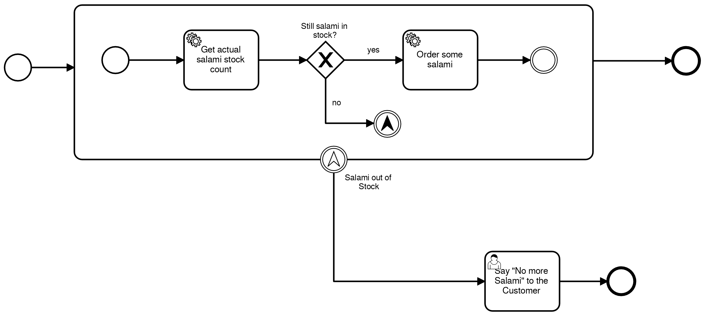

# order salami process
First tryout with the new official camunda springboot starter pom.

# API

## order/
order a new salami - if too much salamis are ordered a human task is created to inform the customer
/order/salami

## stock/

get actual stock count:
GET stock/salami/count

take a salami from the stock
GET /stock/salami

